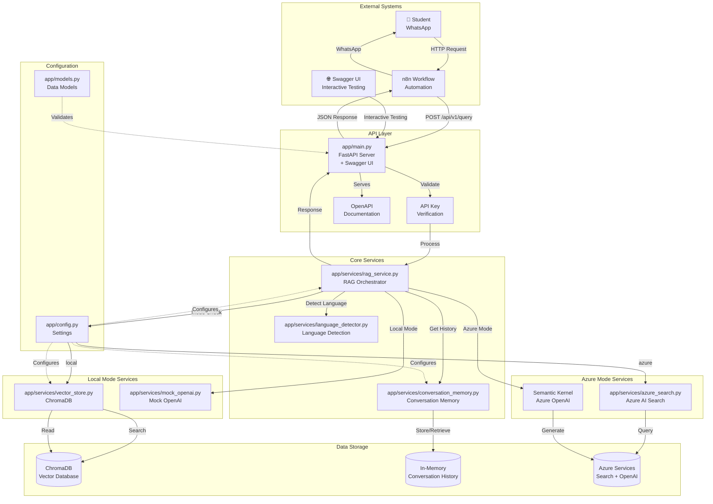
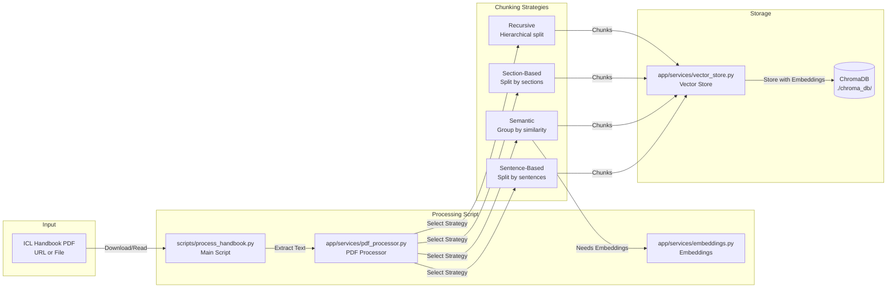
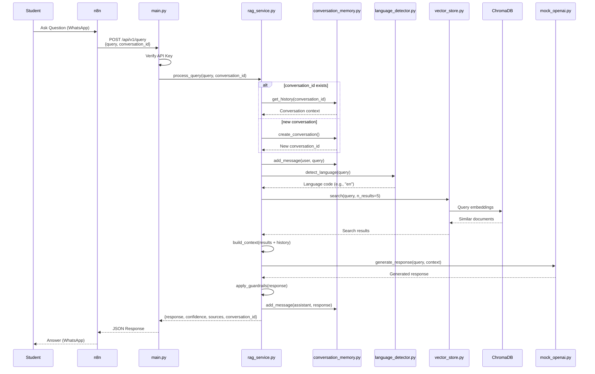
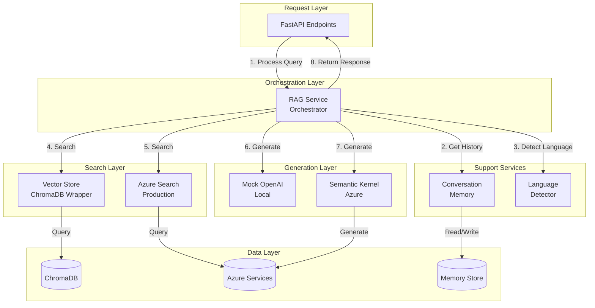
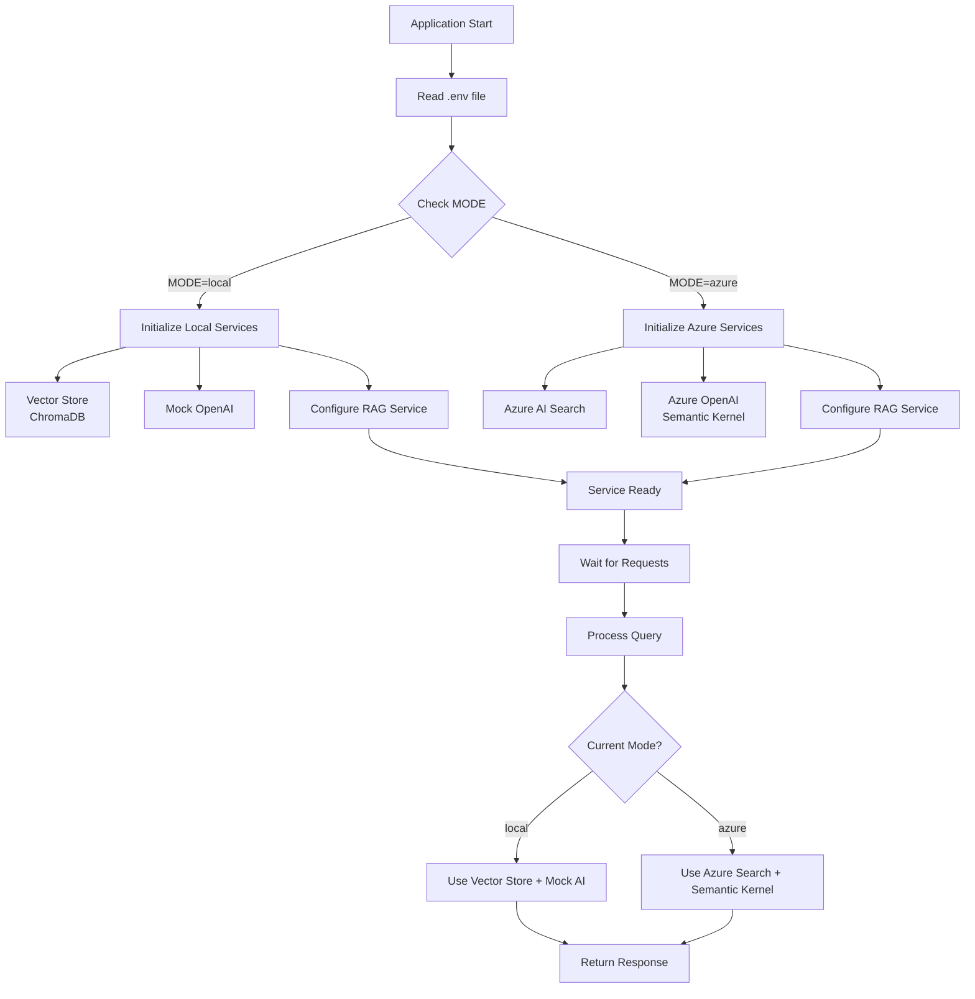
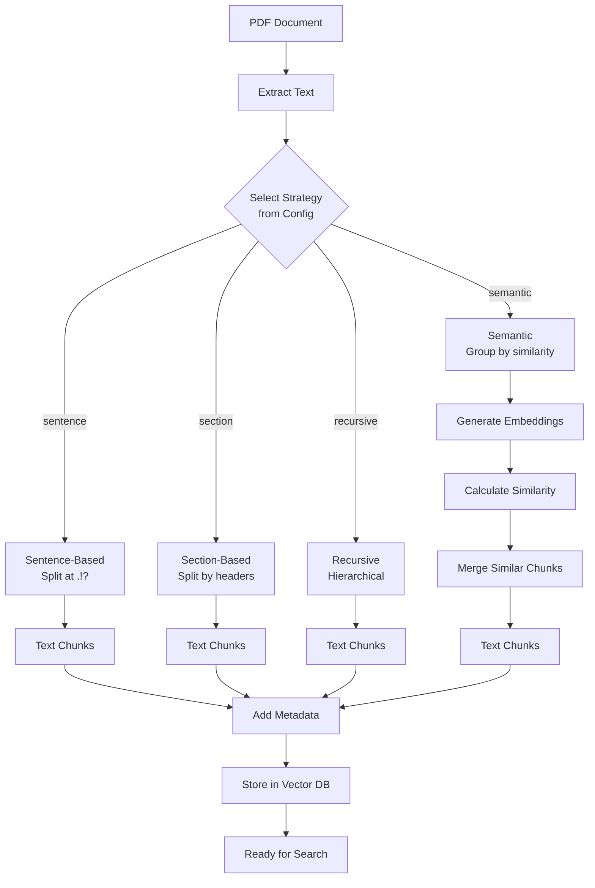
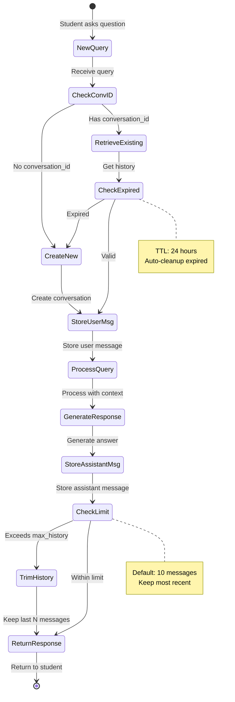
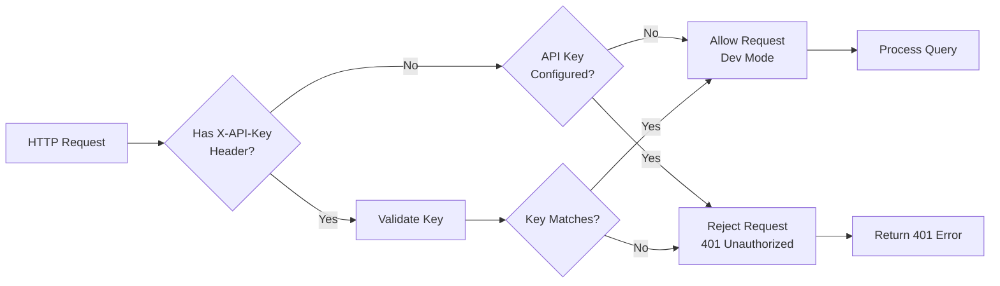
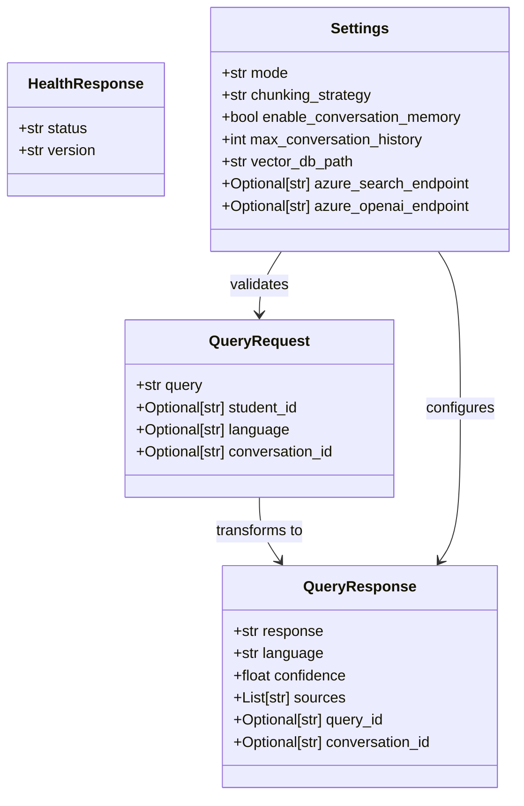
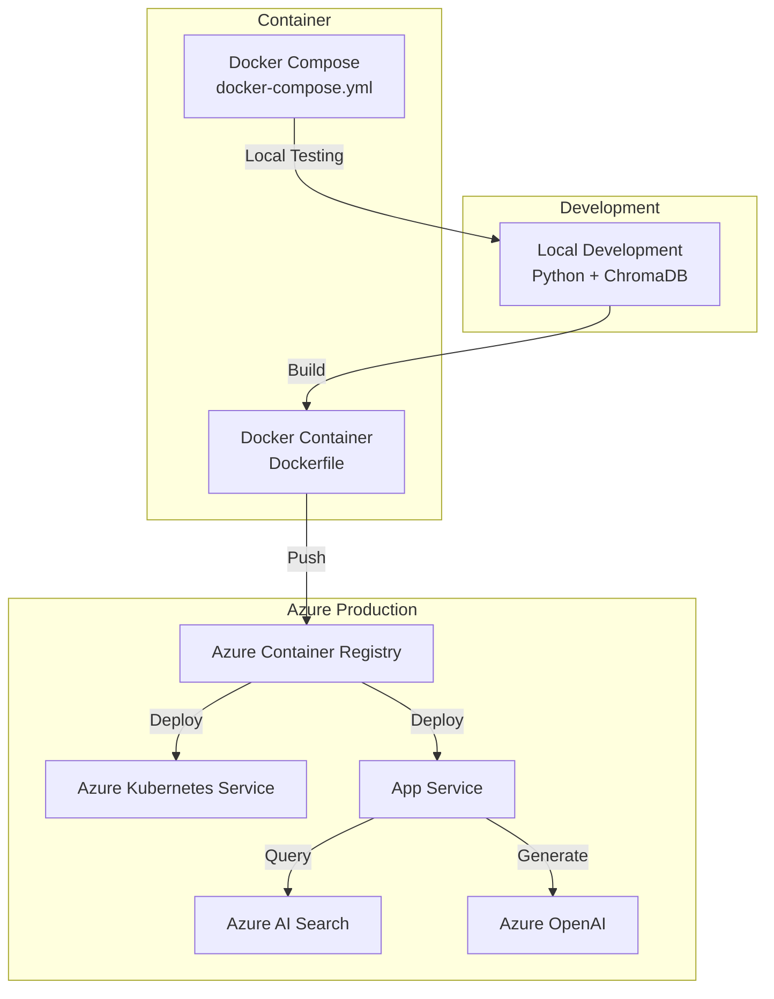

# Application Architecture Diagrams

Visual representation of the RAG Student Support System architecture.

## 🏗️ System Architecture Overview

## 📄 PDF Processing Flow

## 🔄 Query Processing Flow (Detailed)

## 🧩 Component Interaction Diagram

## 🔀 Mode Selection Flow

## 📊 Chunking Strategy Flow

## 💾 Memory Management Flow

## 🔐 Security & Authentication Flow

## 📦 Data Models Relationship

## 🚀 Deployment Architecture

---

## 📝 Legend

- **Solid Arrow (→)**: Direct call/usage
- **Dashed Arrow (-.->)**: Configuration/dependency
- **Box with rounded corners**: Service/Component
- **Box with sharp corners**: File/Module
- **Cylinder**: Database/Storage
- **Diamond**: Decision point
- **Parallelogram**: Input/Output

---

## 🎯 Key Takeaways

1. **Modular Design**: Each component has a single responsibility
2. **Mode Flexibility**: Seamless switching between local and Azure
3. **Memory Management**: Conversation context for follow-up questions
4. **Strategy Pattern**: Configurable chunking strategies
5. **Separation of Concerns**: Clear boundaries between layers
6. **Scalability**: Can scale from local testing to production Azure
