# Production Architecture - Azure & Docker Implementation

Complete architecture diagrams for production deployment using Azure services and Docker containers.

## 🏗️ Production System Architecture

```mermaid
graph TB
    subgraph "Client Layer"
        Student[👤 Student<br/>WhatsApp]
        Admin[👨‍💼 Admin<br/>Dashboard]
    end
    
    subgraph "Integration Layer"
        n8n[n8n Workflow<br/>Automation Platform]
        Webhook[Webhook<br/>Endpoint]
    end
    
    subgraph "Azure Application Gateway"
        Gateway[Application Gateway<br/>Load Balancer<br/>SSL Termination]
    end
    
    subgraph "Azure App Service"
        AppService[App Service<br/>Container Host]
        subgraph "Docker Container"
            FastAPI[FastAPI Application<br/>Python 3.10+<br/>Port 8000]
            Gunicorn[Gunicorn<br/>WSGI Server]
        end
    end
    
    subgraph "Azure AI Services"
        AzureSearch[Azure AI Search<br/>Vector Database<br/>Semantic Search]
        AzureOpenAI[Azure OpenAI<br/>GPT-4 Deployment<br/>Semantic Kernel]
    end
    
    subgraph "Azure Storage"
        ACR[Azure Container Registry<br/>Docker Images]
        BlobStorage[Blob Storage<br/>PDF Documents<br/>Knowledge Base]
    end
    
    subgraph "Azure Monitoring"
        AppInsights[Application Insights<br/>Logging & Metrics]
        LogAnalytics[Log Analytics<br/>Centralized Logs]
    end
    
    subgraph "Azure Security"
        KeyVault[Key Vault<br/>Secrets Management]
        ManagedIdentity[Managed Identity<br/>Service Authentication]
    end
    
    subgraph "CI/CD Pipeline"
        GitHub[GitHub Repository]
        GitHubActions[GitHub Actions<br/>CI/CD Workflow]
        Build[Build Docker Image]
        Push[Push to ACR]
        Deploy[Deploy to App Service]
    end
    
    Student -->|HTTP/HTTPS| n8n
    Admin -->|HTTPS| Gateway
    n8n -->|API Calls| Gateway
    Webhook -->|POST /api/v1/query| Gateway
    
    Gateway -->|Route Traffic| AppService
    AppService -->|Runs| FastAPI
    FastAPI -->|WSGI| Gunicorn
    
    FastAPI -->|Query| AzureSearch
    FastAPI -->|Generate Response| AzureOpenAI
    FastAPI -->|Read Secrets| KeyVault
    FastAPI -->|Authenticate| ManagedIdentity
    
    AzureSearch -->|Index Documents| BlobStorage
    FastAPI -->|Logs| AppInsights
    AppInsights -->|Store Logs| LogAnalytics
    
    GitHub -->|Trigger| GitHubActions
    GitHubActions -->|Build| Build
    Build -->|Push| ACR
    ACR -->|Pull Image| AppService
    GitHubActions -->|Deploy| Deploy
    Deploy -->|Update| AppService
    
    style FastAPI fill:#4CAF50
    style AzureSearch fill:#0078D4
    style AzureOpenAI fill:#0078D4
    style AppService fill:#0078D4
    style ACR fill:#0078D4
```

## 🐳 Docker Container Architecture

## 🔄 Production Data Flow

## 🚀 Deployment Pipeline

## 🔐 Security Architecture

## 📊 Monitoring & Observability

## 🔄 Scaling Architecture

## 🗄️ Data Architecture

## 🌐 Network Architecture

## 📋 Component Summary

### Azure Services Used

| Service | Purpose | Tier |
|---------|---------|------|
| **App Service** | Container hosting | Standard/Premium |
| **Azure AI Search** | Vector database & semantic search | Standard S1 |
| **Azure OpenAI** | LLM for response generation | Pay-per-use |
| **Container Registry** | Docker image storage | Basic |
| **Application Gateway** | Load balancer & SSL | Standard |
| **Key Vault** | Secrets management | Standard |
| **Application Insights** | Monitoring & logging | Pay-per-use |
| **Log Analytics** | Centralized logs | Pay-per-use |
| **Blob Storage** | Document storage | Hot tier |

### Docker Configuration

- **Base Image**: Python 3.10-slim
- **WSGI Server**: Gunicorn with 4-8 workers
- **Port**: 8000 (internal)
- **Health Check**: `/health` endpoint
- **Multi-stage Build**: Optimized image size

### High Availability

- **Multi-region**: Deploy to multiple Azure regions
- **Auto-scaling**: Based on CPU, memory, requests
- **Health Checks**: Automatic instance replacement
- **Backup**: Regular container image backups
- **Disaster Recovery**: Cross-region replication

---

## 🎯 Key Production Features

✅ **Scalability**: Auto-scaling based on load  
✅ **Security**: Private endpoints, Key Vault, managed identity  
✅ **Monitoring**: Application Insights, Log Analytics  
✅ **CI/CD**: Automated deployment pipeline  
✅ **High Availability**: Multi-instance, health checks  
✅ **Performance**: CDN, load balancing, caching  
✅ **Compliance**: Encryption, audit logs, RBAC  
