# How to View Mermaid Diagrams

The `ARCHITECTURE_DIAGRAM.md` file contains Mermaid diagrams that need to be rendered to be viewed as visual diagrams. Here are several ways to view them:

## 🌐 Option 1: View on GitHub (Easiest)

GitHub automatically renders Mermaid diagrams in markdown files.

1. **Push your repository to GitHub:**
   ```bash
   git remote add origin https://github.com/YOUR_USERNAME/YOUR_REPO_NAME.git
   git push -u origin main
   ```

2. **View on GitHub:**
   - Go to your repository on GitHub
   - Click on `ARCHITECTURE_DIAGRAM.md`
   - GitHub will automatically render all Mermaid diagrams!

## 💻 Option 2: VS Code / Cursor Extensions

### Install Mermaid Extension

1. **Open Extensions** (Ctrl+Shift+X or Cmd+Shift+X)
2. **Search for**: "Markdown Preview Mermaid Support"
3. **Install** one of these extensions:
   - **Markdown Preview Mermaid Support** (bierner.markdown-mermaid)
   - **Mermaid Preview** (vstirbu.vscode-mermaid-preview)
   - **Markdown Preview Enhanced** (shd101wyy.markdown-preview-enhanced)

4. **View diagrams:**
   - Open `ARCHITECTURE_DIAGRAM.md`
   - Press `Ctrl+Shift+V` (or `Cmd+Shift+V` on Mac) to open preview
   - Diagrams will render automatically!

## 🌍 Option 3: Online Mermaid Editor

1. **Go to**: https://mermaid.live/
2. **Copy** the Mermaid code from any diagram block (between ` ```mermaid` and ` ``` `)
3. **Paste** into the editor
4. **View** the rendered diagram!

**Example - Copy this code:**

```mermaid
graph TB
    Student[👤 Student<br/>WhatsApp]
    n8n[n8n Workflow<br/>Automation]
    Main[app/main.py<br/>FastAPI Server]
    
    Student -->|HTTP Request| n8n
    n8n -->|POST /api/v1/query| Main
```


## 📱 Option 4: Markdown Preview Tools

### Typora (Desktop App)
- Download: https://typora.io/
- Supports Mermaid diagrams natively
- Open `ARCHITECTURE_DIAGRAM.md` and view!

### Obsidian (Note-taking App)
- Download: https://obsidian.md/
- Supports Mermaid diagrams
- Open your project folder

### Mark Text (Editor)
- Download: https://marktext.app/
- Free, open-source markdown editor
- Supports Mermaid

## 🔧 Option 5: Command Line Tools

### Using Mermaid CLI

1. **Install Mermaid CLI:**
   ```bash
   npm install -g @mermaid-js/mermaid-cli
   ```

2. **Convert to image:**
   ```bash
   mmdc -i ARCHITECTURE_DIAGRAM.md -o architecture.png
   ```

## 📄 Option 6: HTML Preview (Quick Solution)

I've created `view_diagrams.html` in your project root. Simply:
1. Open `view_diagrams.html` in your browser
2. All diagrams will render automatically!

## ✅ Recommended Solution

**For immediate viewing:**
- Use **Option 3** (mermaid.live) - fastest, no setup needed

**For ongoing development:**
- Install **Markdown Preview Mermaid Support** extension in VS Code/Cursor
- Or push to GitHub and view there

**For presentations:**
- Use Typora or convert to images with Mermaid CLI

---

## 🎯 Quick Test

Try viewing this simple diagram on https://mermaid.live/:


Copy the code above (without the markdown code fences) and paste it into mermaid.live to see it rendered!
